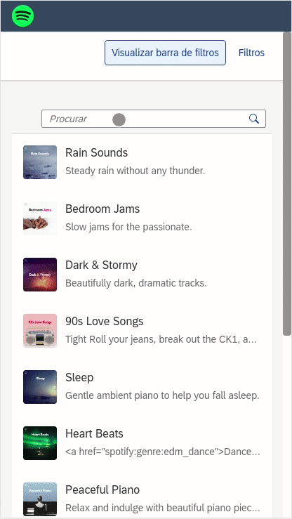

# Spotify Featured Playlists

This is an app that lists spotify featured playlists and enable the user to apply some simple filters to the API.



## Architecture

This app was constructed using SAP UI5 as a framework and it consumes Spotify's API to fetch [featured playlists](https://developer.spotify.com/documentation/web-api/reference/#/operations/get-featured-playlists).

## How to start

### Prerequisites

- [Node.js](https://nodejs.org/en/)

### Installation

- To run the application, first clone the repository to your local machine, and then run the following command in the created folder:

```
yarn install
```

- Then the app can be started with the command:

```
yarn start
```

- _Important_: The application needs a "client ID" from a project created at [Spotify for Developers](https://developer.spotify.com/) to work. My own client ID is configured in the project right now, but that means I need to authorize beforehand any email that will try to sign into the app. Feel free to contact me if you want to. But another option is to create your own "client ID" key and provide it in the "/webapp//util/Constants.js" file.
